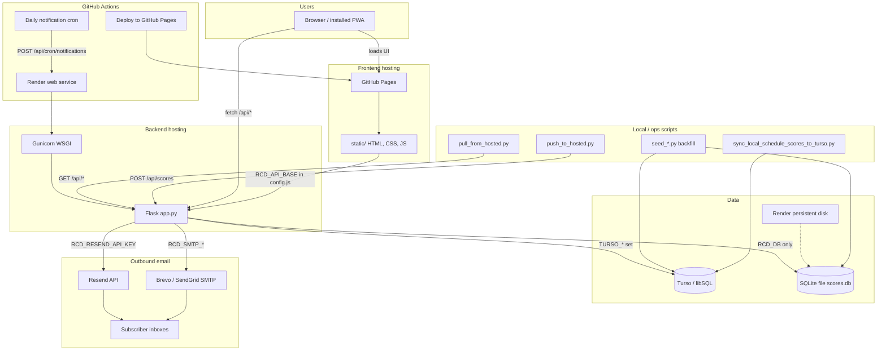

# Hosting

## GitHub Pages (frontend) + Flask host (backend)

GitHub Pages can only host static files. This repo is set up to:

- host the frontend from `static/` via GitHub Pages
- host the Flask API (`/api/*`) on a separate Flask-capable host (e.g. Render)

### Frontend (GitHub Pages)

1. Push to `main`
2. In GitHub repo settings:
   - Settings → Pages → Source: **GitHub Actions**
3. Set your API base URL in `static/config.js`:

```js
window.RCD_API_BASE = "https://your-flask-service.onrender.com";
```

### Backend (Flask host, e.g. Render)

- Start command on Render: `gunicorn --bind 0.0.0.0:$PORT app:app` (Render sets `PORT`). Locally, `python app.py` or `gunicorn app:app` is fine.
- CORS: set `RCD_CORS_ORIGINS` (comma-separated) to your GitHub Pages origin, e.g. `RCD_CORS_ORIGINS=https://<your-user>.github.io`

#### Persist database on Render (scores + email subscriptions)

SQLite lives in the file given by **`RCD_DB`** (default: `scores.db` next to `app.py`). On Render, the default app filesystem is **ephemeral** on the **Free** web tier (data can disappear on deploy or restart). To keep data across deploys:

1. **New deploy from this repo (recommended):** In the [Render Dashboard](https://dashboard.render.com), create a **Blueprint** from the repo and apply [`render.yaml`](render.yaml). It attaches a **persistent disk** at `/var/data`, sets **`RCD_DB=/var/data/scores.db`**, and uses the **Starter** plan (persistent disks are **not** offered on Free web services). Then set secrets such as `RCD_CORS_ORIGINS`, `RCD_RESEND_API_KEY`, and `RCD_CRON_SECRET` on that service.

2. **Existing web service:** Open the service → **Disks** → add a disk (e.g. 1 GB), mount path **`/var/data`** → **Environment** → add **`RCD_DB=/var/data/scores.db`** → upgrade off **Free** if the UI requires it for disks → **Manual Deploy**. Copy any existing data with `python push_to_hosted.py --host …` if the old instance still has the DB.

If you skip a disk and stay on Free, treat the hosted DB as **temporary** unless you use **Turso** (below).

3. **Turso (good for Render Free):** Create a database at [Turso](https://turso.tech/). Set **`TURSO_DATABASE_URL`** (the `libsql://…` URL from the dashboard) and **`TURSO_AUTH_TOKEN`** on your Render web service. The app uses the [`libsql`](https://pypi.org/project/libsql/) client and stores the same SQLite schema in Turso, so **deploys do not erase data**. The first HTTP request that touches the DB runs migrations; or run seed scripts locally with the same env vars—they call **`ensure_schema()`** / `init_db()` first so tables exist. Then: `python seed_schedule.py`, `python seed_main_schedule.py`, `python backfill_standings_from_schedule.py`.

   **Seeing your data:** Turso’s web UI is mostly connection strings, tokens, and metrics—not a full row browser. Open your database in the dashboard and use the **SQL console** (if your plan shows one), or use the CLI: `turso db shell <your-database-name>` then run `SELECT COUNT(*) FROM schedule;` and `SELECT COUNT(*) FROM scores;`. If counts are zero, confirm the URL/token in Render match this same database (easy to mix up two Turso DBs).

### Outbound email (notifications)

The app sends mail through **Resend** (HTTPS), **Brevo API** (HTTPS, recommended on Render), or **SMTP** (e.g. Brevo relay). Set on the server:

| Variable | Purpose |
| -------- | ------- |
| `RCD_EMAIL_FROM` | **Recommended.** From address; Resend requires a verified domain/sender. If unset, a legacy default is used for SMTP only. |
| `RCD_RESEND_API_KEY` | If set, mail goes through Resend (no SMTP password needed). |
| `RCD_BREVO_API_KEY` | **Recommended on Render.** Brevo transactional API key (SMTP & API → API keys & MCP — not the SMTP password). |
| `RCD_SMTP_PASS` | SMTP relay password if API keys are not used. |
| `RCD_SMTP_HOST` | Optional; default `smtp.sendgrid.net`. |
| `RCD_SMTP_PORT` | Optional; default `587`. |
| `RCD_SMTP_USER` | Optional; default `apikey` (SendGrid). |
| `RCD_SMTP_SSL` | Set to `1` for implicit TLS (e.g. port 465). |
| `RCD_EMAIL_FROM_NAME` | Optional display name when `RCD_EMAIL_FROM` is only an address (default: `River City Doubles`). |

Optional: `RCD_NOTIFICATION_TEST_SECRET` — enables `POST /api/notifications/test-email` with JSON `{"secret":"…","to":"you@example.com"}` to verify delivery. The same request also accepts **`RCD_CRON_SECRET`** (header `X-RCD-Cron` or JSON `secret`).

**HTML 500 on test-email** — Often Gunicorn killing the worker while SMTP hangs. Prefer **`RCD_BREVO_API_KEY`** (HTTPS) over SMTP on Render, or check logs for the real error.

**Email not sending (Brevo on Render)** — `/api/notifications/status` can show `smtp_configured: true` while sends still fail. Check:

1. **`RCD_BREVO_API_KEY`** (easiest): Brevo → **SMTP & API** → **API keys & MCP** → create key → set on Render. Keep `RCD_EMAIL_FROM=rivercitydoublessquash@gmail.com` (verified sender).
2. **`RCD_EMAIL_FROM`** must be a **verified sender** in Brevo (see below).
3. **`RCD_SMTP_USER`** is the **SMTP login** from Brevo (often `something@smtp-brevo.com`), only if using SMTP instead of the API key.
4. **`RCD_SMTP_PASS`** must be the **SMTP key** from Brevo (Transactional → SMTP & API), not the HTTP API key.
5. **`RCD_SMTP_HOST`** = `smtp-relay.brevo.com`, **`RCD_SMTP_PORT`** = `587`, leave **`RCD_SMTP_SSL`** unset (STARTTLS).
6. After saving on the site, the API may return **`welcome_email_error`** with the SMTP error text — also check **Render → Logs** for `Email send failed`.
7. Test after deploy: `curl -X POST https://river-city-doubles.onrender.com/api/notifications/test-email -H "X-RCD-Cron: YOUR_RCD_CRON_SECRET" -H "Content-Type: application/json" -d '{"to":"you@example.com"}'`

**Where to verify senders in Brevo (not under Transactional):** open [Senders list](https://app.brevo.com/senders/list) or **your account menu (top right) → Settings → Senders, domains & IPs → Senders**. Click **Add a sender**, enter the same email you use for `RCD_EMAIL_FROM`, and complete the verification code Brevo emails to that address. Better long-term: **Domains** tab → authenticate your domain (DKIM), then any `@yourdomain.com` sender is allowed.

**Cron:** `RCD_CRON_SECRET` enables `POST /api/cron/notifications` (header `X-RCD-Cron` or JSON `secret`). The repo includes a GitHub Actions workflow that pings this daily; match reminders and standings also run when someone submits a handicap score.

**Render free tier: site “hangs” or times out**  
Free web services spin down after ~15 minutes of inactivity. The first request after that triggers a **cold start** (often 30–90 seconds), so the site can look like it’s hanging. Options:

1. **Wait it out** — Reload after 1–2 minutes; the instance will wake and then respond quickly.
2. **Keep the service awake** — Use a free uptime monitor (e.g. [UptimeRobot](https://uptimerobot.com)) to ping your site every 5–10 minutes. Add a monitor for `https://your-app.onrender.com/health`. The app exposes `/health` for this; it returns quickly and does no DB work. That way the service rarely sleeps and most visits are fast.

# River City Doubles

Richmond doubles squash league: box league and handicap league (open & main).

## Architecture & tools

The site splits **static UI** (GitHub Pages) from the **Flask API and database** (Render). Optional services handle email, scheduled notification checks, and cloud database hosting.



### Tool breakdown

| Tool | Role in this project |
| ---- | -------------------- |
| **GitHub** | Source control; hosts the repo and **GitHub Pages** for the public UI (`static/` only). |
| **GitHub Actions — `gh-pages.yml`** | On push to `main`, uploads `static/` and deploys to GitHub Pages. |
| **GitHub Actions — `notifications-cron.yml`** | Daily at **13:30 UTC** (~8:30 AM US Eastern in standard time), `POST`s the hosted `/api/cron/notifications` using secrets `NOTIFICATIONS_CRON_URL` and `NOTIFICATIONS_CRON_SECRET` (must match `RCD_CRON_SECRET` on Render). |
| **GitHub Pages** | Serves `index.html`, `app.js`, `styles.css`, images, and PWA assets. Cannot run Python or store scores. |
| **`static/config.js`** | Sets `window.RCD_API_BASE` to the Render URL when the UI is on `github.io`; uses same-origin when opened on localhost or `river-city-doubles.onrender.com`. |
| **Render** | Hosts the Flask app (`render.yaml`: **Gunicorn**, health check `/health`, optional **persistent disk** at `/var/data` with `RCD_DB=/var/data/scores.db`). |
| **Gunicorn** | Production WSGI server on Render (`gunicorn --bind 0.0.0.0:$PORT app:app`). |
| **Flask (`app.py`)** | REST API (`/api/scores`, `/api/schedule`, `/api/standings`, subscriptions, cron); serves the same static files when run locally; handicap/box notification logic. |
| **Flask-CORS** | Allows the GitHub Pages origin to call the Render API when `RCD_CORS_ORIGINS` is set. |
| **SQLite (`scores.db`)** | Default local database path (`RCD_DB`); file on disk on Render when using a persistent disk. |
| **Turso (libSQL)** | Optional cloud database when `TURSO_DATABASE_URL` + `TURSO_AUTH_TOKEN` are set; same schema as SQLite, survives Render deploys without a disk. Accessed via Python **`libsql`** in `rcd_db.py`. |
| **`rcd_db.py`** | Chooses Turso or local SQLite for all app and seed-script database access. |
| **Resend** | Optional transactional email over HTTPS (`RCD_RESEND_API_KEY`); used instead of SMTP when set. |
| **Brevo / SendGrid (SMTP)** | Alternative email path (`RCD_SMTP_HOST`, `RCD_SMTP_PASS`, etc.); production often uses Brevo relay. |
| **python-dotenv** | Loads `.env` locally for secrets (see `.env.example`); not used on Render (env vars in dashboard). |
| **Browser PWA** | `manifest.webmanifest` + `sw.js` for installable UI; `app.js` talks to the API and manages schedules, standings, players, and notification signup. |
| **`box_rosters.py`** | Server-side box player lists (aligned with `static/app.js`) for box-league notification matching. |
| **Seed / maintenance scripts** | `seed_schedule.py`, `seed_main_schedule.py`, `seed_recovered_2025.py`, `backfill_standings_from_schedule.py` populate schedule/scores; `pull_from_hosted.py` / `push_to_hosted.py` sync via HTTP API; `scripts/sync_local_schedule_scores_to_turso.py` copies local `schedule`+`scores` to Turso; `scripts/fix_player_name_spellings.py` and `scripts/send_example_email.py` for one-off fixes and tests. |
| **UptimeRobot (optional)** | External ping to `/health` every few minutes to reduce Render free-tier cold starts (see **Render free tier** below). |

### Typical request flows

1. **View standings (hosted UI)** — Browser loads Pages → `app.js` calls `GET https://river-city-doubles.onrender.com/api/standings/handicap/open` → Flask reads Turso or SQLite → JSON back to the UI.
2. **Submit a score** — `POST /api/scores` → row stored → for handicap, may trigger match-reminder and week-complete standings emails to subscribed players in that division.
3. **Daily notifications** — GitHub Actions cron → `POST /api/cron/notifications` with cron secret → Flask re-runs notification checks for all weeks/levels/years.
4. **Local dev** — `python app.py` serves UI + API on port 5000 with local `scores.db`; optional `.env` for Turso or SMTP testing.

## Run the app

**Backend (Python/Flask):**

```bash
python3 -m venv venv
source venv/bin/activate   # Windows: venv\Scripts\activate
pip install -r requirements.txt
python app.py
```

Then open [http://localhost:5000](http://localhost:5000). The Flask app serves the UI and stores scores in a SQLite database (`scores.db` in the project root, or path in `RCD_DB`).

**Syncing with the hosted site:** Local and hosted each have their own database. To copy hosted data to local, run `python pull_from_hosted.py --host https://river-city-doubles.onrender.com`. To push your local score/schedule updates to the hosted site, run `python push_to_hosted.py --host https://river-city-doubles.onrender.com`.

**Why aren’t scores updated (on the hosted site)?** Common causes: (1) **Different databases** — local and hosted don’t share data; push with `push_to_hosted.py` after local changes (that script targets the HTTP API, not Turso). (2) **Hosted DB is ephemeral** — On Render’s Free web tier the default SQLite file is wiped on deploy/restart; fix with a **persistent disk** + **`RCD_DB`**, or **`TURSO_DATABASE_URL`** + **`TURSO_AUTH_TOKEN`** (Turso), per **Persist database on Render** above.

## Features

- **Home** — Short description of the league (box vs handicap).
- **Input Score** — Submit a match: league (box/handicap), level (open/main), week, optional handicap, both team names, and games won (best of 5). Submitting sends you to Rankings.
- **Rankings** — Handicap Open and Handicap Main. Points: 1 for playing, 1 for winning the match, 1 per game won. Data is stored in SQLite.

## API

- `POST /api/scores` — Submit a score (JSON: league, level, week, team1, team2, games1, games2; optional handicap).
- `GET /api/rankings/<league>/<level>` — Get rankings (e.g. `/api/rankings/handicap/open`).
